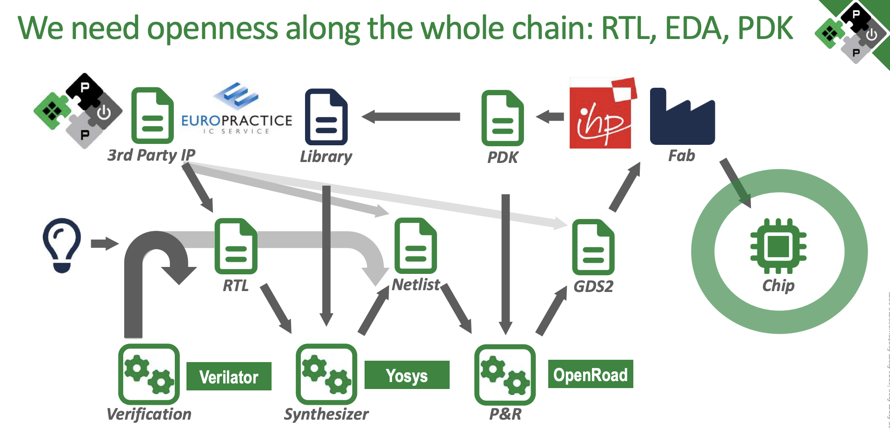

# 瑞士蘇黎世理工 ETH Zürich 的 pulp 

* 演講投影片：[Designing Linux-capable systems using open EDA tools](https://pulp-platform.org/docs/coscup2024/phsauter_coscup24.pdf), Philippe Sauter at Integrated Systems Laboratory (ETH Zürich).
    * https://github.com/pulp-platform
    * [COSCUP 2024 : TR611 Open Source Inspired Hardware (and their happy friends) Designing Linux-capable systems-on-chip using open-source EDA tools by Philippe Sauter](https://coscup.org/2024/zh-TW/session/XPMEGT)

## pulp 使用下列 Open Source Tools

1. Verilator: Verification (Verilog => RTL)
2. YosisHQ: Synthesizer (RTL => Netlist)
3. OpenROAD: Place and Route (Netlist => GDS2)

GDS2: https://en.wikipedia.org/wiki/GDSII

但是 Open PDK 非常重要，否則很難建構起來

所以 ETH Zürich 的 pulp 團隊釋出了

1. Basilisk: Designed in IHP 130nm OpenPDK, CVA6 based SoC
    * Basilisk is the first end-to-end open-source Linux-capable RV64 SoC
2. Croc SoC: A simple chip for students.
    * https://github.com/pulp-platform/croc

## Croc SoC

* https://github.com/pulp-platform/croc/

You need to build/install the required tools manually:

* Bender: Dependency manager
* Morty: SystemVerilog pickler
* SVase: SystemVerilog pre-elaborator
* SV2V: SystemVerilog to Verilog
* Yosys: Synthesis tool
* OpenRoad: Place & Route tool
* (Optional) Verilator: Simulator
* (Optional) Questasim/Modelsim: Simulator

可以直接用 docker 建立環境

* https://github.com/pulp-platform/croc/blob/main/docker-compose.yml
